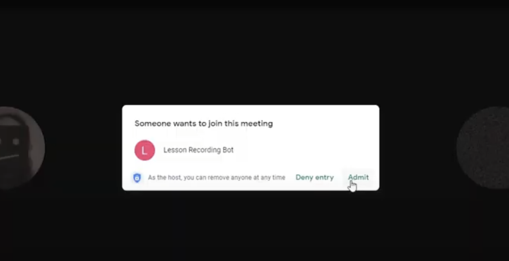

Our district didn't have enterprise google meet for a while so I made this bot that could join and record classes from a webserver and isolate only the teacher audio/video for compliance. Files would then be processed and available for download from a web portal. The bot uses pupeteer and shell scripting for postprocessing.

